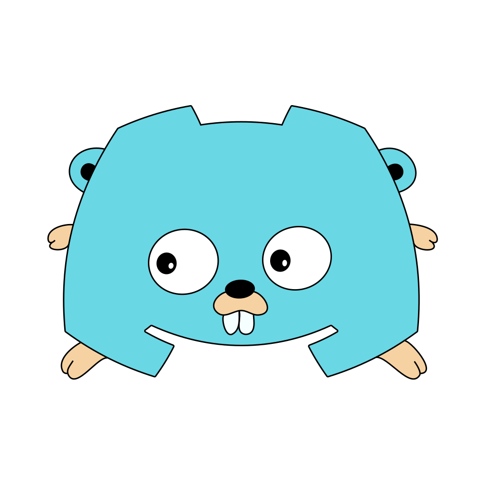

## dgo linked roles example

This example demonstrates Discord Linked Roles with a bot session and an
OAuth2 user authorization flow. It registers application role-connection
metadata, serves the authorization endpoints, and updates the user's role
connection after the OAuth2 callback.

The example uses the standalone Go module in this directory and requires Go
1.26.6 or newer.

### Build

```sh
go build
```

### Configure and run

Register the callback URL with the Discord application. The callback path is
`/linked-roles-callback`, and the server listens on port `8010`.

```sh
./linked_roles \
  -app YOUR_APPLICATION_ID \
  -token YOUR_BOT_TOKEN \
  -secret YOUR_OAUTH2_CLIENT_SECRET \
  -redirect https://your.example.com
```

Then direct users to `https://your.example.com/linked-roles`. The `redirect`
value must be the public base URL registered with Discord; the example appends
`/linked-roles-callback` to it.

The example also loads a local `.env` file. Keep bot tokens, client secrets,
and OAuth2 credentials out of source control, and run the callback through a
TLS-terminating HTTPS endpoint in deployments.
